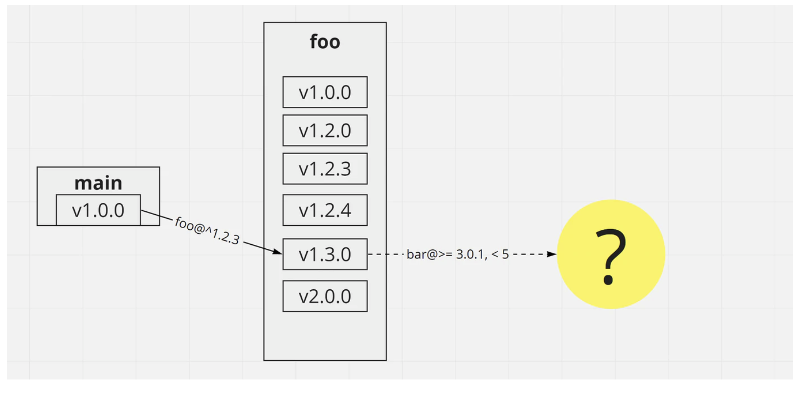

# npm, yarn and node_modules

## From module to package

The module was a mechanism to divide the JavaScript program into multiple files and load them as needed. (1 file = 1 module)

A package , on the other hand, is a mechanism that treats multiple module files as one independent unit. By creating a larger group called a package, you can assign a version number, register the package in the package registry, and manage dependencies.

## With Node.js `package.json`

The package `package.json` can be characterized by its approximate presence. `package.json` Is a file mainly used by NPM, which will be described later, and Node.js itself is not aware of most of its functions. But only some fields are handled by Node.js itself . Specifically, there are the following two fields.

```json
{
  "name": "some-library",
  "main": "./lib/some-library.js"
}
```

This is used to find the Node.js `require`. For example `require('./some-library')`, if you do, one of the following files will be used:

```js
./some-library.js
./some-library.json
./some-library.node
./some-library/${main} (./some-library/package.jsonがある場合)
./some-library/index.js
./some-library/index.node
```

If there `require` is a redirect by `package.json`, the relative path from there will be resolved based on the destination file name. For example, consider the following configuration.


`main.js`

```js
require('./some-library');
```

`./some-library/package.json`

```json
{
  "name": "some-library",
  "main": "./dist/index.js"
}
```

`./some-library/dist/index.js`

```js
require('./internal-util.js');
```

`./some-library/dist/internal-util.js`

```js
//..
```

In this case, `./some-library` the import will `./some-library/dist/index.js` be resolved to. 
`./internal-util.js` The relative path from there is relative to, `./some-library` not `./some-library/dist/index.js`, so `./some-library/dist/internal-util.js` it resolves correctly .

## Discovery from the path

`require` The arguments of are divided into the following three types according to their prefixes.

- `./../` Starts with or ... Relative path (relative to the current module file)
    - Typically used to refer to "files in a package"
- `/` Starts with ... Absolute pass
- other than that
    - Typically used to refer to "files in another package"

In the case of "other than that", the first thing to be searched is the core module, that is , the lib folder of node itself . `fs` and `url`, but is typical.

If it is not a core module, it will be searched as follows.

```js
./node_modules/
../node_modules/
../../node_modules/
(...all the way to the root)
$NODE_PATH/   ($NODE_PATH: NODE_PATH environment variable element)
$HOME/.node_modules   ($HOME: Home folder)
$HOME/.node_libraries   ($HOME: Home folder)
$PREFIX/lib/node   ($PREFIX: Prefix defined by Node.js)
```

`$NODE_PATH` Is `$PATH` similar to that, you can specify more than one by a colon (semi-colon on Windows) separated.

In today's Node.js development, it is not recommended to put the library globally, so `node_modules` basically you can forget about the other rules.

The important thing here is that Node.js path resolution recursively searches the parent directory . "`node_modules/foo` Module is in `node_modules/foo/node_modules/bar` the `node_modules/bar` nature of reference can be both" is a very important point in order to explain the implementation of which will be described later npm.


## Import from another file in the library

In the past, well-known libraries such as history and uuid recommended imports such as:

```js
// Import only the function called createBrowserHistory in the history library 
const createBrowserHistory = require('history/createBrowserHistory');
// Import only the function called v4 in the uuid library 
const uuidv4 = require('uuid/v4');
```

In this case, `package.json` the `main` field is ignored 2 for, `./node_modules/history/createBrowserHistory.js` and `./node_modules/uuid/v4.js` will be is referenced. To be consistent with this behavior, these packages usually `index.js` put it in the package root.

In the first place, such import was preferred with the aim of reducing the bundle size when using a JavaScript bundler (described later) such as webpack. Now that Tree shaking (described later) has been developed, the advantages are small, and even for history and uuid, the following imports are currently recommended.

```js
const createBrowserHistory = require('history').createBrowserHistory;
const uuidv4 = require('uuid').v4;
```

## Resolving symbolic links

Node.js resolves symbolic links. At this time:
- Module identity is determined based on the resolved path.
- require The relative path of is based on the resolved path.

`main.js`

```js
const module1 = require('./module1'); // => Loading: module1.js
const module2 = require('./module2'); // Prints nothing

module1.printPath(); // => __filename = module1.js
module2.printPath(); // => __filename = module1.js
```

`module1.js`

```js
console.log(`Loading: ${__filename}`);

exports.printPath = () => {
  console.log(`__filename = ${__filename}`);
};
```

```cmd
ln -s module1.js module2.js
```

## npm

The above are the functions provided by Node.js, but they are not very convenient by themselves. These features really come into their own when combined with npm.

npm's job is to manage package versions and dependencies, and then `node_modules` place (vendor) a copy of the package below.

The main comparisons with other package management tools are:

### Features of npm 1: Dependency resolution is done locally in the project.

For example, if you use Rubygems for Ruby or pip for Python alone, the dependencies will be stored in the system directory ( `/usr/local/lib` such as) or the user directory ( `/home/user/` such as the hidden directory inside ) and that version will be used as is. This method has problems such as low reproducibility regarding the version of the dependency and unnecessary conflicts when trying to develop multiple projects at the same time in the same environment.

Like Rust's Cargo, go's go modules, etc., npm manages dependent versions for each project.

### npm feature 2: Vendoring.

Ruby's Bundler and Go's go modules store the dependent library data itself in the system directory or user directory (by default), and select the version you need at runtime or build.

Due to Node.js restrictions, npm always `node_modules` works by copying the dependencies to a directory in the project .

### npm feature 3: Multiple versions can coexist in the dependency graph.

For example, in the case of Ruby, all packages pollute the global namespace. Since it is customary to use the same name (top-level module name) as the package name, it is unlikely that multiple versions will work at the same time. For that reason, bundler cannot use multiple versions of packages with the same name at the same time.

Node.js doesn't pollute the global namespace (unless you specifically write it), and modules can exist without interfering with each other. Therefore, like Rust (Cargo), multiple versions of a package with the same name can exist at the same time.

(Go (go modules) can also coexist with multiple major versions, so in a sense it can be considered to have the same properties.)

### npm feature 4: has a centralized registry.

Ruby, Python, has its own centralized registry such as Rust, rails, numpy, serdesimple name is attached as. npm has a similar mechanism.

Go `github.com/go-yaml/yaml` describes the package name in the form of a URL like, and when resolving the dependency, the package is actually fetched from the corresponding git repository. Specify the `https://deno.land/std@0.68.0/testing/asserts.ts` dependent module in the URL like deno 


### npm and yarn

Npm isn't the only package management tool for Node.js. This section also describes yarn (yarn v1, classic yarn), which is highly compatible with npm and is widely used.

yarn is an alternative package management tool for npm created by Facebook. The job of yarn is almost the same as npm. That is, it manages package versions and dependencies, and based on that node_modules, places (vendors) a copy of the package below. The main differences are:

- Detailed behavior when resolving dependencies.
- Lock file type. npm use the `npm-shrinkwrap.json` and `package-lock.json`,while yarn use `yarn.lock`.
- The default registry for reading. npm uses `registry.npmjs.org`, but yarn gets the `registry.yarnpkg.com` package because it's a replica of it . (Because it is a replica, the behavior seen by the user is the same)


### Package

A package is `package.json` a directory or archive file (tar.gz) that contains it. You can put various information on the `package.json`, but if you explain only the necessary information from the viewpoint of package management, it will be as follows.

```json
{
  "name": "some-package",
  "version": "0.1.0",
  // Dependencies and their version constraints 
  "dependencies": {
    "library1": "^0.3.1",
    "library2": ">= 1.2.0, < 3.0.0"
  },
  // Dependencies required when developing this package itself 
  "devDependencies": {
    "testing-library1": "^1.2.3",
    "linter1": "2.x"
  },
  // Packages and their versions that should be included at the same time 
  "peerDependencies": {
    "state-management-library1": ">= 10.2"
  },
  // dependencies and Similar, but ignore if the dependent installation fails 
  "optionalDependencies": {
    "windows-specific-library": "3.x"
  }
}
```

Like many other package management tools, dependencies specify a version range (version constraints). For example, `^1.2.3` does not have to be exactly version `1.2.3`, and larger versions (if the major version is 1) are OK.

Note that unlike Rust (Cargo) and Go (go modules) , simply writing `1.2.3` on npm means `=1.2.3`. The npm package is expected to follow the semantic version, so basically you should use the caret constraint (`^1.2.3`).

### npm install / yarn install flow

The npm / yarn process can be roughly divided into two stages.

- Dependency resolution creates a dependency graph from `package.json`.
- Expand the dependency graph to create a `node_modules` tree from the dependency graph.

Exporting the `node_modules` tree created in this way completes the work of npm install/yarn install.


### Dependency resolution

Dependency resolution assigns specific versions to version constraints.


Once the version is assigned, the dependency of the destination package is resolved more recursively.



You're done when all the required package dependencies have been resolved.

Multiple packages may have the same constraints, or multiple constraints may be resolved to the same version. Therefore, the result of dependency resolution is a DAG (Directed Acyclic Graph) instead of a tree. This is called a dependency graph here .


### Expansion of dependency graph

In the case of npm / yarn, creating a dependency graph is not the end. Node.js works independently of npm / yarn, so you need to deploy the package to `node_modules` beforehand so that Node.js will resolve the module as intended. At this time, it is not obvious how to expand the dependency graph to `node_modules`.

Consider the example of the dependency graph above.

### Deployment up to npm@2

Up to version 2 of npm expand this dependency graph as follows:


Notice that there is also a node_modules directory inside the node_modules directory. If you have multiple versions of the same package in your dependency graph, you can't just put all the versions in the root node_modules. So, until version 2 of npm, all indirect dependencies were expanded individually to the corresponding package node_modules instead of the root.

This method solves the so-called dependency hell (multiple versions cannot coexist), but the problem is that the same version of the same package is deployed multiple times . This has the following negative effects:
- The size of node_modules, which is already large, becomes even larger.
- Since it is not the same module from the viewpoint of Node.js, it may behave unexpectedly in modules that have side effects or modules where the identity of objects is important.

### Deployment of npm@3 and later and yarn: Package winding

Unfortunately, the latest npm / yarn doesn't solve the above problem, but npm version 3 and later and yarn implement mitigations. These versions of npm / yarn expand this dependency graph as follows:


That is, you can choose one version from the indirect dependent packages and place it in a higher level node_modules. This will often allow the package to be shared. Since Node.js require searches in order from node_modules that is closer to the import source file, the version according to the dependency graph is still required.

This method is called package hoisting .

A problem with package hoisting is the nondeterminism of dependency graph expansion. This will be discussed later.

### Indirect dependence winding

Indirect dependence is also rolled up as much as possible. For example, consider a dependency graph that expands in npm v2 as follows:

```
main
|- foo1 (1.0.0)
|  |- bar1 (2.0.0)
|     |- baz1 (1.0.0)
|     |- baz2 (2.0.0)
|- bar1 (1.0.0)
|- baz2 (1.0.0)
```

Trong trường hợp này, main phụ thuộc vào phiên bản 1 của bar1, vì vậy phụ thuộc của main → foo1 → bar1 (chỉ định phiên bản 2) không được cuộn lại. Vì vậy, bar1 là một phụ thuộc gián tiếp thực sự.

Vì vậy, phụ thuộc những gì về bar1 của baz1 và baz2? Trong npm v3 trở lên, mỗi cái trong số này được cuộn lại như sau.

- baz2 cannot be rolled up in two stages because main depends on different versions of baz1. However, one-step winding is possible.
- Since baz1 can be wound in two stages, it can be wound in two stages.

The result is a node_modules tree like the one below.

```
main
|- foo1 (1.0.0)
|  |- bar1 (2.0.0)
|  |- baz2 (2.0.0)
|- bar1 (1.0.0)
|- baz1 (1.0.0)
|- baz2 (1.0.0)
```

### Bonus: Deployment using symbolic links

It is logically possible to solve the problem that the same version of the same package is installed multiple times, and there is a way to use symbolic links. This method is introduced in the Node.js documentation as "Methods for OS package management tools", but it should also be applicable to node_modules.


If there is a symbolic link, the identity is determined based on the resolved path of the symbolic link, so bar@1.0.0 and bar@2.0.0 will be read once each. Can be guaranteed.

It's unclear why npm and yarn don't use this method. Maybe there's a problem I don't know about, or maybe there's some reason I don't want to use symlinks.However, at present, methods that do not vendor to node_modules such as tink and berry (yarn v2) are more promising, so it seems that there is little advantage in implementing a method to use node_modules better from now on.

### Lock file

Not limited to npm / yarn, package management is usually non-deterministic as it is. In the case of npm / yarn, it is non-deterministic due to the following two factors.

1. Nondeterminism of dependency resolution. Most package management tools, except go modules, resolve to the largest version possible, so what the specification ^ 1.2.3 resolves to depends on the state of the registry. If you only have 1.2.3 and 1.3.0, it will resolve to 1.3.0, but if you try to resolve it again after 1.4.0 is released, it will resolve to 1.4.0.
2. Nondeterminism of deployment. When pulling indirect dependencies up to node_modules, the simple rules do not determine which version will be adopted. Therefore, the results may change for the reasons described below.

To solve these problems, both npm / yarn provide a lock file mechanism. However, the lock file provided by npm and the lock file provided by yarn have slightly different roles.


### yarn.lock

yarn.lockIs a lock file generated by yarn that records the result of dependency resolution , that is, the dependency graph . The following is an example.

```
ajv@^5.3.0:
  version "5.5.2"
  resolved "https://registry.yarnpkg.com/ajv/-/ajv-5.5.2.tgz#73b5eeca3fab653e3d3f9422b341ad42205dc965"
  integrity sha512-Ajr4IcMXq/2QmMkEmSvxqfLN5zGmJ92gHXAeOXq1OekoH2rfDNsgdDoL2f7QaRCy7G/E6TpxBVdRuNraMztGHw==
  dependencies:
    co "^4.6.0"
    fast-deep-equal "^1.0.0"
    fast-json-stable-stringify "^2.0.0"
    json-schema-traverse "^0.3.0"

ajv@^6.1.0, ajv@^6.10.0, ajv@^6.10.2:
  version "6.10.2"
  resolved "https://registry.yarnpkg.com/ajv/-/ajv-6.10.2.tgz#d3cea04d6b017b2894ad69040fec8b623eb4bd52"
  integrity sha512-TXtUUEYHuaTEbLZWIKUr5pmBuhDLy+8KYtPYdcV8qC+pOZL+NKqYwvWSRrVXHn+ZmRRAu8vJTAznH7Oag6RVRw==
  dependencies:
    fast-deep-equal "^2.0.1"
    fast-json-stable-stringify "^2.0.0"
    json-schema-traverse "^0.4.1"
    uri-js "^4.2.2"

ajv@^6.12.0:
  version "6.12.0"
  resolved "https://registry.yarnpkg.com/ajv/-/ajv-6.12.0.tgz#06d60b96d87b8454a5adaba86e7854da629db4b7"
  integrity sha512-D6gFiFA0RRLyUbvijN74DWAjXSFxWKaWP7mldxkVhyhAV3+SWA9HEJPHQ2c9soIeTFJqcSdFDGFgdqs1iUU2Hw==
  dependencies:
    fast-deep-equal "^3.1.1"
    fast-json-stable-stringify "^2.0.0"
    json-schema-traverse "^0.4.1"
    uri-js "^4.2.2"

ajv@^6.12.2:
  version "6.12.3"
  resolved "https://registry.yarnpkg.com/ajv/-/ajv-6.12.3.tgz#18c5af38a111ddeb4f2697bd78d68abc1cabd706"
  integrity sha512-4K0cK3L1hsqk9xIb2z9vs/XU+PGJZ9PNpJRDS9YLzmNdX6jmVPfamLvTJr0aDAusnHyCHO6MjzlkAsgtqp9teA==
  dependencies:
    fast-deep-equal "^3.1.1"
    fast-json-stable-stringify "^2.0.0"
    json-schema-traverse "^0.4.1"
    uri-js "^4.2.2"
```

In reality, there are many such entries.

Hash values etc. are also recorded, but it is essentially `{version constraint → resolved version}` a map. This is nothing more than specifying one dependency graph

That yarn.lock itself is dependency resolution (generation of the dependency graph) to ensure the results of up to, but in its own expansion of the dependency graph does not guarantee results up. yarn takes an approach that guarantees the reproducibility of the latter half by using a "deterministic and reliable algorithm".

### npm-shrinkwrap.json / package-lock.json

On the other hand, npm will generate either npm-shrinkwrap.json/ package-lock.json. The two record the same information in the same format .

```json
{
  "name": "main",
  "version": "0.1.0",
  "lockfileVersion": 1,
  "requires": true,
  "dependencies": {
    "ajv": {
      "version": "6.10.2",
      "requires": {
        "fast-deep-equal": "^2.0.1",
        "fast-json-stable-stringify": "^2.0.0",
        "json-schema-traverse": "^0.4.1",
        "uri-js": "^4.2.2"
      },
      "dependencies": {
        "fast-deep-equal": {
          "version": "2.0.1"
        }
      }
    },
    // ...
    "babel-loader": {
      "version": "8.1.0",
      "requires": { /* ... */ },
      "dependencies": {
        "ajv": {
          "version": "6.12.0",
          "requires": {
            "fast-deep-equal": "^3.1.1",
            "fast-json-stable-stringify": "^2.0.0",
            "json-schema-traverse": "^0.4.1",
            "uri-js": "^4.2.2"
          }
        },
        // ...
      }
    },
    // ...
    "har-validator": {
      "version": "5.1.0",
      "requires": { /* ... */ },
      "dependencies": {
        "ajv": {
          "version": "5.5.2",
          "requires": {
            "co": "^4.6.0",
            "fast-deep-equal": "^1.0.0",
            "fast-json-stable-stringify": "^2.0.0",
            "json-schema-traverse": "^0.3.0"
          }
        },
        // ...
      }
    },
  }
}
```

Whereas yarn.lock was a flat list, this one has a nested structure. This is because it records the structure as it is when expanded to node_modules. Unlike yarn.lock, it's easy to see which version is installed in ./node_modules/ajv.

This means that npm-shrinkwrap.json / package-lock.json has enough information to reproduce the structure under ./node_modules.

However, historically there was a time when it was said that ./node_modules was not reproducible using npm-shrinkwrap.json. I think this is either because npm-shrinkwrap.json wasn't read correctly, or npm-shrinkwrap.json wasn't automatically exported, but this is accurate when investigated. I didn't know what it was, so I'll put it on hold.

The differences between npm-shrinkwrap.json and package-lock.json are as follows.

- npm-shrinkwrap.json has existed since the early days of npm, but package-lock.json appeared in npm version 5.
- If both are present, npm-shrinkwrap.json takes precedence.
- If neither exists, package-lock.json will be generated automatically. (npm version 5 or later)
- package-lock.json is not included in packages that you publish to the registry. npm-shrinkwrap.json is included.
- Even if there is package-lock.json in a package other than the top level, it will be ignored. npm-shrinkwrap.json is considered.

### devDependencies, optionalDependencies, acceptDependencies

devDependencies are dependencies that are specified only if you are a top-level package.

For libraries, those that are only used when developing the library itself are usually specified in devDependencies. Common examples are lint tools (eslint), formatters (prettier), tests (jest), transpilers (typescript), and type information (@types/*). However, keep in mind that whether or not you should put it in devDependencies depends not on the type of library, but on how you use it. For example, if you have a wrapper library that calls eslint, eslint is also needed at runtime, so it might be better to put it in dependencies.

For applications distributed via npm, it's a good idea to put anything you don't need to launch the application in devDependencies. It's desirable to follow similar rules for applications that always work from the source tree rather than via npm, but in reality it doesn't seem to make any difference.

optionalDependencies is similar to dependencies, but tolerates installation failures of dependent packages. For example, chokidar is a library that monitors file system changes and uses the features of the fsevents library on macOS. Installation of fsevents fails on non-macOS, but npm install does not fail because the dependency of chokidar → fsevents is specified by optionalDependencies.

acceptDependencies is a new dependency specification added in npm v7. Like devDependencies, it has the effect of changing the behavior depending on whether it is a top-level package or not. It seems that it was implemented to avoid the problem that constraint validation on engine is too strict while maintaining compatibility with npm v6 and earlier.

### peerDependencies

peerDependencies is a function that specifies the dependency of the dependency source package, not its own dependency.

A typical pattern is a plugin-to-framework dependency. For example, Webpack, a well-known JavaScript bundler, does not aggregate its functionality into webpack packages, but provides them in a number of plugin plugin packages. For example, you'll need css-loader to have Webpack load CSS, so you'll have to write a dependency on both webpack and css-loader, but this combination of versions may not work correctly. (Only webpack is too old or css-loader is too old)

Therefore, package.json on the css-loader side describes the version of webpack that can be used in combination with that version of css-loader. For example for css-loader 4.3.0

```
"peerDependencies": {
    "webpack": "^4.27.0 || ^5.0.0"
  }
```

Because it says, it is supposed to be combined with webpack version 4.27.0 or higher and less than 6. This is not a dependency of css-loader itself, but a specification of webpack dependency from the package that uses css-loader.

The intent itself is as above, but the actual behavior when peerDependencies is specified depends on the version of npm.

### Main differences

- In npm v1 to v2 , the packages listed in peerDependencies will be installed automatically, and an error will occur if it is not possible due to version restrictions.
- In npm v3 to v6 and yarn v1 8 , the peerDependencies description is used only for warnings. (Warns when the specified package does not exist and when the version constraint is incorrect)
- In npm v7 9 , the packages listed in peerDependencies will be installed automatically and a warning will be displayed if version restrictions do not allow (= another version is already installed for another reason).

### Behavior when the package specified by peerDependencies does not exist

The behavior that corresponds to "Forgot to write a dependency on webpack" depends on the version of npm.

For npm v1 and v2, the contents of peerDependencies will be installed automatically. If you write a dependency on css-loader, webpack will be installed automatically as well.

In npm v3 to v6, the contents of peerDependencies are not installed automatically. Only the existence check is performed, and if it does not exist, a warning is displayed.

With npm v7-beta, the contents of peerDependencies will be installed automatically. If --legacy-peer-deps is specified, the behavior will be the same as v3 to v6.

yarn v1 is similar to npm v3 to v6.

### Behavior when peerDependencies version constraints are not met

The webpackbehavior that corresponds to "if only the dependency is too old " depends on the version of npm.

An error will occur with npm v1 and v2 .

A warning will be issued on npm v3 and later and yarn v1 and the installation of the version specified in peerDependencies will be abandoned.

### Behavior when the package specified by peerDependencies does not exist, but the constraint is accidentally satisfied by winding up from another indirect dependency

The webpackbehavior that corresponds to "I forgot to write a dependency on, but happened to get webpack down due to winding up from another dependency" depends on the version of npm.

There is no winding in npm v1 ~ v2 .

In npm v3 ~ , it is treated as if the constraint is satisfied and no warning is issued.

A warning is issued with yarn v1 .

### Behavior when the package specified by peerDependencies does not exist, but contains a version that does not meet the constraint due to winding from another indirect dependency

The webpackbehavior that corresponds to "I forgot to write a dependency on, but happened to get webpack down due to winding up from another dependency" depends on the version of npm.

There is no winding in npm v1 ~ v2 .

A warning will be issued for npm v3 to v6 and yarn v1 , and the installation of the version specified in peerDependencies will be abandoned.

In npm v7 , peerDependencies is resolved before winding, so winding does not occur.

### bundledDependencies

bundledDependencies is an array of package names, unlike other * Dependencies family fields. (That is, use it with other dependencies type fields)

Normally npm pack doesn't include under ./node_modules in the archive, but it seems to only include that directory if the package is specified in bundledDependencies.

I don't seem to have many opportunities to use it, so I will omit the details.

### scope

Scope is supported in npm version 2 and above. Npm packages typically use names that don't include slashes, such as babel-core, but names that start with @ are called scopes and are treated as slash-separated prefixes. For example, @babel/core is a package in the scope @ babel.

Scopes are mainly used for the following purposes.

- Reserve the right to use a cohesive namespace on the official npm registry.
- Publish private packages on the official npm registry. (Requires scope for private package)
- Refer to another registry only for a specific scope.

The scope has no special behavior from the viewpoint of dependency resolution, but when it is expanded on the file system, it is expanded into a two-layer directory as the name suggests. For example, if it depends on babel-core and babel-runtime, it will be expanded as follows,

```
main/
|- node_modules/
   |- babel-core/
      |- package.json
   |- babel-runtime/
      |- package.json
```

If you depend on @babel/core and @babel/runtime:

```
main/
|- node_modules
   |- @babel/
      |- core/
         |- package.json
      |- runtime/
         |- package.json
```

From Node.js's point of view, require ("babel-core") just becomes require ("@babel/ core"), but this structure is used when TypeScript refers to DefinitelyTyped type definitions. There is also.

### Require a package that does not exist

npm expands packages so that packages written in packages.json can be required (from within that package), but due to the operating principle of Node.js, packages not written in packages.json can also be required by chance. It may be.
- When indirect dependence is rolled up.
- If the direct or indirect source depends on the package.
- If you have a project with multiple package.json and npm install is also done in the parent directory.

If the "Cannot find module" only happens in certain environments, it's a good idea to suspect these cases.

### Summary

- Node.js itself package.jsonwo requirenot concern the packaging system except for using the redirection, combination with the package manager, such npm / yarn is assumed.
- Currently, the mainstream methods (npm, yarn v1, etc.) use ./node_modulesdirectory-dependent vendoring of dependent packages. Due to this constraint, npm / yarn is not only responsible for generating the dependency graph, but also for deciding how to deploy it on the file system.
- At this time, in order to prevent the module tree from exploding while preventing the dependency hell (and ensuring the module identity of the same package as much as possible), a method called winding is used. Winding was introduced in npm v3 and later.
- npm and yarn use different lock file formats, which are the first and second results of the above two-step solution (generation of dependency graph → determination of placement method on file system). Each corresponds.
- npm now automatically generates lock files in v5 and later, improving the reliability of lock files.
- In npm, in addition to dependencies and devDependencies, there is a special dependency description called peerDependencies. This has the effect of additionally specifying the dependency of the dependency source, but the behavior differs depending on the version.
- Prior to npm v2, the description of peerDependencies was compulsory.
In npm v3 to v6 and yarn, the description of peerDependencies was used only for warning.
- In npm v7, the description of peerDependencies is respected as much as possible, but failure to satisfy the constraint does not cause an error.
- There are some cases where a non-existent package require is successful. Be package.jsoncareful especially in projects with multiple projects.

[JS Ecosystem Burari Exploration (3): npm, yarn and node_modules](https://qiita.com/qnighy/items/677bf64063c666b21034)